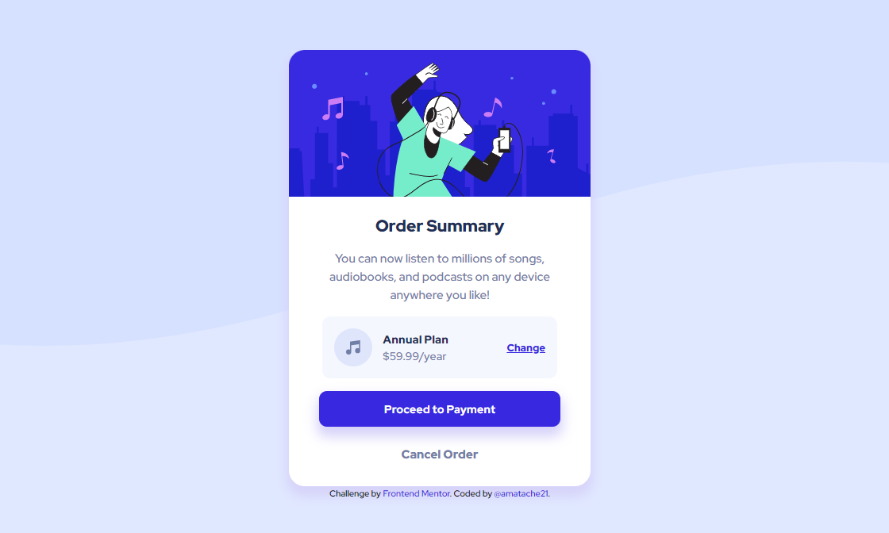
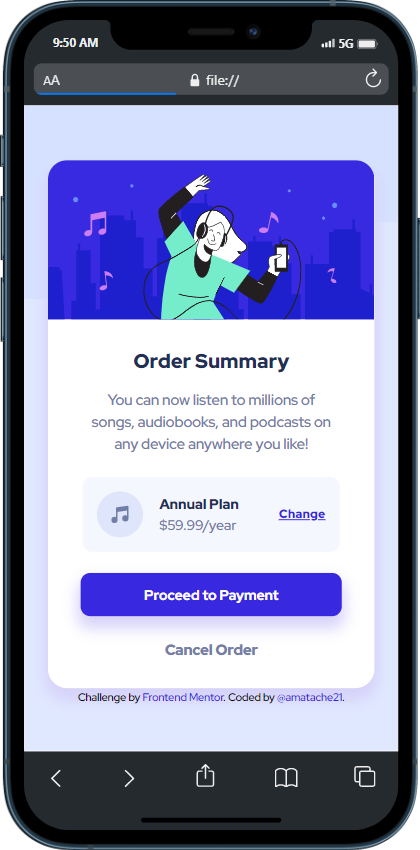

# Frontend Mentor - Order summary card solution

This is a solution to the [Order summary card challenge on Frontend Mentor](https://www.frontendmentor.io/challenges/order-summary-component-QlPmajDUj). Frontend Mentor challenges help you improve your coding skills by building realistic projects. 

## Table of contents

- [Overview](#overview)
  - [The challenge](#the-challenge)
  - [Screenshot](#screenshot)
  - [Links](#links)
- [My process](#my-process)
  - [Built with](#built-with)
- [Author](#author)
- [Acknowledgments](#acknowledgments)

## Overview

### The challenge

Users should be able to:

- View the optimal layout depending on their device's screen size
- See hover and focus states for interactive elements

### Screenshots

  
  

### Links

- Solution URL: https://github.com/amatache21/frontend-amatache/tree/main/Frontend%20Mentor%20Projects/4.%20order-summary-component-main
- Live Site URL: https://amatache21.github.io/frontend-amatache/Frontend%20Mentor%20Projects/4.%20order-summary-component-main/

## My process

### Built with

- Semantic HTML5 markup
- CSS custom properties
- Flexbox
- Media Queries 
- Google Fonts

## Author

Andrei Matache
- Frontend Mentor - [@amatache21](https://www.frontendmentor.io/profile/amatache21)
- GitHub - [@amatache21](https://github.com/amatache21/frontend-amatache)
- Facebook - [Andrei Matache](https://www.facebook.com/matache.andrei.18/)
- Twitter - [Andrei Matache](https://twitter.com/AndreiMatache6)

## Acknowledgments

In this part, I just want to thank the entire Frontend Mentor community for the wonderful opportunity that they give us, to exercises and improve our web development skills. These challenges are amazing and, in my opinion, they build the perfect foundation for a frontend career.

Thank you Frontend Mentor! 